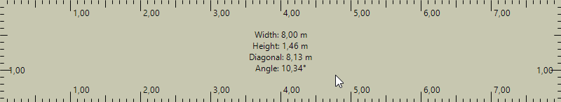

# Advanced Screen Ruler

[](https://opensource.org/licenses/MIT)

A versatile, on-screen measurement tool for Windows, built with C# and Windows Forms. Measure pixels, calibrate to real-world units, and get instant diagonal and angle calculations right on your screen. Perfect for designers, engineers, cartographers, and anyone who needs to measure objects within digital images, maps, or blueprints.



## ✨ Features

-   **On-Screen Measurement**: A semi-transparent, frameless window that you can drag and resize over any application.
-   **Custom Calibration**: Define your own scale (e.g., `150 pixels = 4.5 meters`) to measure anything in your preferred units.
-   **Interactive Measurement Tool**:
    -   Draw multiple measurement lines directly on the ruler.
    -   Each line displays its length in real-time based on your calibration.
    -   Lines are drawn with unique, cycling colors for clarity.
    -   Clear all lines with a single middle-click.
-   **Adaptive UI & Enhanced Visibility**:
    -   The central info hub automatically switches between detailed, abbreviated, vertical, and single-line layouts depending on the ruler's size.
    -   All measurement lines and text have a high-contrast outline, ensuring they are perfectly visible on any background.
    -   Horizontal and vertical axes are color-coded for quick identification.
-   **Real-Time Info Hub**: A central display shows live calculations for Width, Height, Diagonal Length, and Angle.
-   **Toggleable "Always on Top"**: Easily toggle whether the ruler stays on top of other windows via the context menu.
-   **Resizable & Draggable**: Easily move the ruler and resize it from any corner or edge.

## 🚀 Getting Started

You can either run the pre-compiled executable or build the project from the source code.

### For Users (Pre-compiled)

1.  Go to the [**Releases**](https://github.com/hardway777/ScreenRuler/releases) page of this repository.
2.  Download the latest `.zip` file.
3.  Extract the contents and run `ScreenRuler.exe`.

### For Developers (Building from Source)

#### Prerequisites

-   [.NET 6.0 SDK (or newer)](https://dotnet.microsoft.com/download)
-   [Visual Studio 2022](https://visualstudio.microsoft.com/) with the ".NET desktop development" workload installed.

#### Build Steps

1.  Clone the repository:
    ```sh
    git clone https://github.com/hardway777/ScreenRuler.git
    ```
2.  Navigate to the project directory:
    ```sh
    cd ScreenRuler
    ```
3.  Open the `ScreenRuler.sln` file in Visual Studio.
4.  Build the solution by pressing `Ctrl+Shift+B` or run it directly by pressing `F5`.

## 📖 How to Use

1.  **Launch** the application.
2.  **Drag** the ruler by left-clicking and holding anywhere inside its body.
3.  **Resize** the ruler by dragging its edges or corners.
4.  **Right-click** to open the context menu for **Calibration**, **Always on Top**, or to **Close** the app.
5.  **Left-click** once to start drawing a measurement line. A dashed preview will follow your cursor.
6.  **Left-click** a second time to finish the line.
7.  **Middle-click** while drawing to cancel the current line.
8.  **Middle-click** on an empty area to clear all finished lines.

## Changelog

### v1.1 - The Annotation Update
This major update transforms the ruler from a passive measurement grid into an active annotation tool.

-   **New Features:**
    -   Implemented an interactive multi-line measurement tool.
    -   Added a dynamic preview line that follows the cursor during measurement.
    -   Introduced an adaptive UI for the central info hub (abbreviated, vertical, and single-line modes).
    -   Added a toggleable "Always on Top" option in the context menu.
-   **Improvements & Fixes:**
    -   Added high-contrast outlines to all measurement lines and text for superior visibility.
    -   Color-coded the horizontal and vertical axes for easier differentiation.
    -   Improved measurement precision by fixing `double`/`int` type conversions.
    -   Updated the measurement line color palette to avoid conflicts with the default background color.
    -   Added the ability to cancel drawing a line with a middle-click.

## 🤝 Contributing

Contributions are welcome! If you have ideas for new features, find a bug, or want to improve the code, please feel free to:

-   Open an issue to discuss the change.
-   Fork the repository and submit a pull request.

## 📜 License

This project is licensed under the MIT License. See the [LICENSE](LICENSE) file for details.