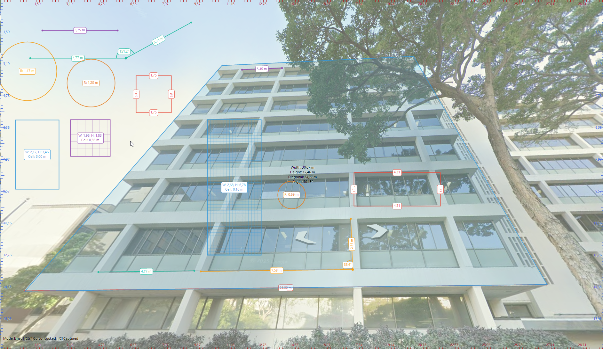

# Advanced Screen Ruler

Универсальный экранный измерительный инструмент для Windows, созданный на C# и Windows Forms. То, что начиналось как простая линейка, превратилось в мощный 2D-инструмент для измерений и аннотаций, идеально подходящий для дизайнеров, инженеров и разработчиков игр.

Он позволяет измерять пиксели, калибровать их в реальные единицы измерения и анализировать геометрию на статичном, панорамируемом холсте, захваченном с вашего экрана, теперь с поддержкой коррекции перспективы.

## ✨ Возможности

-   **Измерение в перспективе (v5.0)**: Определите 4-точечную перспективную плоскость на изображении и измеряйте расстояния внутри нее так, как если бы вы работали на плоской поверхности. Инструмент использует билинейную интерполяцию для предоставления точных, скорректированных с учетом перспективы измерений.

-   **Полный набор инструментов для рисования**: Переключайтесь между несколькими инструментами для измерения всего, что вам нужно.
    -   **Линии**: Измерение расстояния между двумя точками, с коррекцией перспективы или без нее.
    -   **Углы**: Измерение угла по трем точкам с возможностью переключения между внутренним и внешним углом.
    -   **Окружности**: Определение по центру и радиусу.
    -   **Прямоугольники**: Определение по диагональным углам, с метками длины для каждой стороны.
    -   **Сетки**: Создание прямоугольных сеток с настраиваемым размером ячейки (в откалиброванных единицах).
    -   **Маркеры**: Размещение меток для выделения интересных точек и отображения их координат.

-   **Продвинутые инструменты точности**: Рисуйте с точностью, как в CAD-программах.
    -   **Прилипание к точкам (S)**: Автоматически "примагничивает" курсор к ближайшей точке любой существующей фигуры. Радиус прилипания настраивается.
    -   **Направляющие (D)**: Отображает направляющие линии, когда курсор выравнивается по горизонтали или вертикали с другими точками привязки.
    -   **Блокировка осей (Shift)**: Ограничивает рисование по горизонтальной или вертикальной оси.
    -   **Блокировка курсора (Ctrl)**: Удерживайте, чтобы заблокировать курсор в текущей позиции для точных кликов.

-   **Холст и захват фона**: Работайте со статичным изображением вашего экрана.
    -   **Захват (C)**: Делает снимок экрана текущего монитора для использования в качестве статичного фона.
    -   **Панорамируемый холст**: Перемещайте фон и все нарисованные фигуры с помощью **клавиш со стрелками**.
    -   **Два режима перетаскивания**:
        -   **Обычное перетаскивание**: Перемещает окно и холст вместе.
        -   **Перемещение "вьюпорта" (Shift + Drag)**: Перемещает только окно над статичным холстом.
    -   **Настраиваемое наложение**: Используйте **Shift + колесо мыши**, чтобы изменить прозрачность цветного наложения.

-   **Интерактивная перекалибровка (R)**: Войдите в режим перекалибровки, кликните по любой нарисованной линии и введите ее реальную длину, чтобы мгновенно перекалибровать весь холст.

-   **Полноценное управление сессиями**: Никогда не теряйте свою работу.
    -   **Сохранить/Загрузить сессию**: Сохраняйте все нарисованные фигуры, состояние окна, смещение холста и калибровку в единый файл `.sez`. Захваченный фон также включается в файл сохранения.
    -   **Ассоциация файлов**: Открывает файлы `.sez`, переданные в качестве аргумента командной строки.

-   **Встроенная справка и улучшения интерфейса**:
    -   Нажмите **H**, чтобы открыть/закрыть экранную панель помощи со всеми горячими клавишами.
    -   Контекстно-зависимая информация появляется рядом с курсором.
    -   Все метки фигур отрисовываются в скругленной рамке для максимальной четкости.

## 🚀 Начало работы

### Для пользователей (скомпилированная версия)

1.  Перейдите на страницу [**Релизы**](https://github.com/hardway777/ScreenRuler/releases) этого репозитория.
2.  Скачайте последний `.zip` архив.
3.  Распакуйте содержимое и запустите `ScreenRuler.exe`.
4.  (Опционально) Чтобы ассоциировать файлы `.sez`, кликните правой кнопкой мыши по `.sez` файлу, выберите "Открыть с помощью" > "Выбрать другое приложение", найдите и выберите `ScreenRuler.exe` и поставьте галочку "Всегда использовать это приложение".

### Для разработчиков (сборка из исходного кода)
*Требуется .NET 6.0+ и Visual Studio 2022.*

1.  Клонируйте репозиторий: `git clone https://github.com/hardway777/ScreenRuler.git`
2.  Откройте `ScreenRuler.sln` в Visual Studio и соберите проект.

## 📖 Как использовать

### Управление мышью
-   **Левый клик**: Поставить точку для текущего режима рисования.
-   **Перетаскивание ЛКМ**: Перемещает окно и холст вместе.
-   **Shift + Перетаскивание ЛКМ**: Перемещает только окно ("режим вьюпорта").
-   **Средний клик**:
    -   *Во время рисования*: Отменяет создание текущей фигуры.
    -   *На пустой области*: Очищает все нарисованные фигуры.
-   **Колесо мыши**: Настраивает контекстно-зависимое значение (радиус прилипания, размер ячейки или тип угла).
-   **Shift + Колесо мыши**: Настраивает прозрачность наложения на фон в режиме захвата.
-   **Правый клик**: Открывает контекстное меню.

### Горячие клавиши
-   **Режимы рисования**:
    -   `1`: Линии
    -   `2`: Углы
    -   `3`: Окружности
    -   `4`: Прямоугольники
    -   `5`: Сетка
    -   `6`: Плоскость перспективы
    -   `*`: Маркеры
    -   `R`: Перекалибровка по линии
-   **Модификаторы точности**:
    -   `S`: Включить/выключить прилипание к точкам.
    -   `D`: Включить/выключить направляющие.
    -   `Shift`: Удерживайте во время рисования для блокировки оси.
    -   `Ctrl`: Удерживайте для блокировки курсора в текущей позиции.
-   **Холст и фон**:
    -   `C`: Захватить экран текущего монитора в качестве фона.
    -   `X`: Очистить захваченный фон.
    -   `Стрелки`: Панорамировать холст.
    -   `Home`: Сбросить панорамирование.
-   **Общие**:
    -   `H`: Показать/скрыть экран помощи.

## История изменений

### v5.0 - The Perspective Update
-   **Новые возможности:**
    -   **Измерение в перспективе**: Добавлен режим рисования `Perspective` (`6`) для определения 4-точечной плоскости.
    -   Линии, нарисованные внутри этой плоскости, автоматически измеряются с учетом коррекции перспективы.
    -   Процесс создания плоскости направляет пользователя через ввод истинной ширины и высоты.
-   **Улучшения и исправления:**
    -   **Новый стиль меток**: Все метки фигур теперь отрисовываются внутри скругленной белой рамки с цветной обводкой для максимальной четкости.
    -   Улучшен предпросмотр при создании перспективной плоскости.
    -   Рисование теперь ограничено границами перспективной плоскости, если начато внутри нее.
    -   Исправлена критическая ошибка в вычислениях для вертикальных или горизонтальных базовых линий перспективы.

### v4.1
-   **Улучшения и исправления:**
    -   Исправлено рисование меток для всех фигур.
	
### v4.0
-   **Новые возможности:**
    -   Добавлен интерактивный режим перекалибровки (`R`).
    -   Добавлено сохранение/загрузка сессии в сжатый файл `.sez`, включая фоновое изображение.
    -   Добавлена поддержка открытия `.sez` файлов через командную строку.
-   **Улучшения и исправления:**
    -   Переработана логика перетаскивания мышью для интуитивного панорамирования.
    -   Улучшен инструмент "Сетка" с умным размером по умолчанию и пропорциональной настройкой.
    -   Исправлена ошибка наложения текста состояния на шкалу.

## 🤝 Участие в проекте

Я приветствую любой вклад! Если у вас есть идеи для новых функций, вы нашли ошибку или хотите улучшить код, пожалуйста:

-   Откройте "issue", чтобы обсудить изменение.
-   Сделайте "fork" репозитория и отправьте "pull request".

## 📜 Лицензия

Этот проект распространяется под лицензией MIT. Подробности см. в файле [LICENSE](LICENSE).