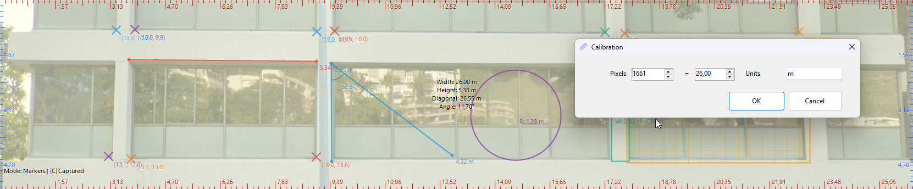

# Advanced Screen Ruler

Универсальный экранный измерительный инструмент для Windows, созданный на C# и Windows Forms. То, что начиналось как простая линейка, превратилось в мощный 2D-инструмент для измерений и аннотаций, идеально подходящий для дизайнеров, инженеров и разработчиков игр.

Он позволяет измерять пиксели, калибровать их в реальные единицы измерения и анализировать геометрию на статичном, панорамируемом холсте, захваченном с вашего экрана.

## ✨ Возможности

-   **Полный набор инструментов для рисования**: Переключайтесь между несколькими инструментами для измерения всего, что вам нужно.
    -   **Линии**: Измерение расстояния между двумя точками.
    -   **Углы**: Измерение угла по трем точкам с возможностью переключения между внутренним и внешним углом.
    -   **Окружности**: Определение по центру и радиусу с автоматическими расчетами.
    -   **Прямоугольники**: Определение по диагональным углам.
    -   **Сетки**: Создание прямоугольных сеток с настраиваемым размером ячейки (в откалиброванных единицах).
    -   **Маркеры**: Размещение меток для выделения интересных точек и отображения их координат.

-   **Продвинутые инструменты точности**: Рисуйте с точностью, как в CAD-программах.
    -   **Прилипание к точкам (S)**: Автоматически "примагничивает" курсор к ближайшей точке любой существующей фигуры. Радиус прилипания настраивается.
    -   **Направляющие (D)**: Отображает направляющие линии, когда курсор выравнивается по горизонтали или вертикали с другими точками привязки.
    -   **Блокировка осей (Shift)**: Ограничивает рисование по горизонтальной или вертикальной оси.

-   **Холст и захват фона**: Работайте со статичным изображением вашего экрана.
    -   **Захват (C)**: Делает снимок экрана текущего монитора для использования в качестве статичного фона. Линейка становится полностью непрозрачной для ясности.
    -   **Панорамируемый холст**: Перемещайте фон и все нарисованные фигуры с помощью **клавиш со стрелками** или перетаскиванием мыши.
    -   **Перемещение "вьюпорта" (Shift + Drag)**: Перемещайте окно линейки независимо от статичного холста, как будто это камера.
    -   **Настраиваемое наложение**: Используйте **Shift + колесо мыши**, чтобы изменить прозрачность цветного наложения для идеального контраста.
    -   **Очистка (X)**: Убирает фон и возвращает линейку в обычный режим.

-   **Полноценное управление сессиями**: Никогда не теряйте свою работу.
    -   **Сохранить/Загрузить сессию**: Сохраняйте все нарисованные фигуры, положение окна, размер и настройки калибровки в JSON-файл. Загружайте их в любое время.

-   **Встроенная справка и улучшения интерфейса**:
    -   Нажмите **H**, чтобы открыть/закрыть экранную панель помощи со всеми горячими клавишами.
    -   Контекстно-зависимая информация появляется рядом с курсором (радиус прилипания, размер сетки и т.д.).
    -   Весь текст отрисовывается с высококонтрастной тенью для отличной читаемости на любом фоне.

## 🚀 Начало работы

### Для пользователей (скомпилированная версия)

1.  Перейдите на страницу [**Релизы**](https://github.com/hardway777/ScreenRuler/releases) этого репозитория.
2.  Скачайте последний `.zip` архив.
3.  Распакуйте содержимое и запустите `ScreenRuler.exe`.

### Для разработчиков (сборка из исходного кода)
*Требуется .NET 6.0+ и Visual Studio 2022.*

1.  Клонируйте репозиторий: `git clone https://github.com/hardway777/ScreenRuler.git`
2.  Откройте `ScreenRuler.sln` в Visual Studio и соберите проект.

## 📖 Как использовать

### Управление мышью
-   **Левый клик**: Поставить точку для текущего режима рисования.
-   **Перетаскивание ЛКМ**: Перемещает окно и холст вместе (или только окно с зажатым `Shift` в режиме захвата).
-   **Средний клик**:
    -   *Во время рисования*: Отменяет создание текущей фигуры.
    -   *На пустой области*: Очищает все нарисованные фигуры.
-   **Колесо мыши**: Настраивает контекстно-зависимое значение (радиус прилипания, размер ячейки или тип угла).
-   **Shift + Колесо мыши**: Настраивает прозрачность наложения на фон в режиме захвата.
-   **Правый клик**: Открывает контекстное меню.
-   **CTRL**: Блокировка курсора

### Горячие клавиши
-   **Режимы рисования**:
    -   `1`: Линии
    -   `2`: Углы
    -   `3`: Окружности
    -   `4`: Прямоугольники
    -   `5`: Сетка
    -   `*`: Маркеры
-   **Модификаторы точности**:
    -   `S`: Включить/выключить прилипание к точкам.
    -   `D`: Включить/выключить направляющие.
    -   `Shift`: Удерживайте во время рисования для блокировки оси.
-   **Холст и фон**:
    -   `C`: Захватить экран текущего монитора в качестве фона.
    -   `X`: Очистить захваченный фон.
    -   `Стрелки`: Панорамировать холст.
    -   `Home`: Сбросить панорамирование.
-   **Общие**:
    -   `H`: Показать/скрыть экран помощи.

## История изменений
### v3.1
-  Добавлено блокирование курсора по нажатию клавиши CTRL.

### v3.0 - The Precision CAD Update
Эта версия превращает линейку в полноценный 2D-инструмент для измерений и аннотаций с панорамируемым холстом, несколькими режимами рисования и продвинутыми функциями точности.

-   **Новые возможности:**
    -   **Несколько режимов рисования**: Добавлены инструменты для измерения углов, окружностей, прямоугольников, сеток и расстановки маркеров.
    -   **Система захвата фона**: Добавлена возможность захватывать экран и использовать его как статичный, панорамируемый холст.
    -   **Модификаторы точности**: Реализованы прилипание к точкам (`S`), направляющие (`D`) и блокировка осей (`Shift`).
    -   **Полноценное управление сессиями**: Добавлена функция сохранения/загрузки всех настроек и нарисованных фигур.
    -   **Экран помощи**: Новая панель помощи (`H`) отображает все горячие клавиши.
-   **Улучшения и исправления:**
    -   **Продвинутое управление мышью**: Переработана логика мыши для различения кликов и перетаскиваний. Реализовано панорамирование "вьюпорта" через `Shift`+Drag.
    -   **Контекстные настройки**: Колесо мыши теперь динамически настраивает радиус прилипания, размер ячейки или тип угла.
    -   **Улучшенная читаемость**: Весь текст теперь имеет высококонтрастную тень.
    -   **Улучшения UX**: Добавлено физическое прилипание курсора, улучшено позиционирование текста угла и реализован умный размер по умолчанию для сетки.
    -   Исправлено критическое исключение `OutOfMemoryException`, связанное с рисованием углов.
    -   Исправлены многочисленные ошибки, связанные с наложением интерфейса и расчетом координат.

### v2.0 - The Annotation Update
Это крупное обновление превратило линейку из пассивной измерительной сетки в активный инструмент для аннотаций.

-   **Новые возможности:**
    -   Реализован интерактивный инструмент для измерения нескольких линий.
    -   Добавлена динамическая линия предпросмотра, следующая за курсором.
    -   Введен адаптивный интерфейс для центрального информационного блока.
    -   Добавлена опция "Поверх всех окон" в контекстном меню.
-   **Улучшения и исправления:**
    -   Добавлены высококонтрастные обводки для всех измерительных линий и текста.
    -   Горизонтальные и вертикальные оси были окрашены в разные цвета.
    -   Улучшена точность измерений путем исправления преобразования типов `double`/`int`.

## 🤝 Участие в проекте

Я приветствую любой вклад! Если у вас есть идеи для новых функций, вы нашли ошибку или хотите улучшить код, пожалуйста:

-   Откройте "issue", чтобы обсудить изменение.
-   Сделайте "fork" репозитория и отправьте "pull request".

## 📜 Лицензия

Этот проект распространяется под лицензией MIT. Подробности см. в файле [LICENSE](LICENSE).